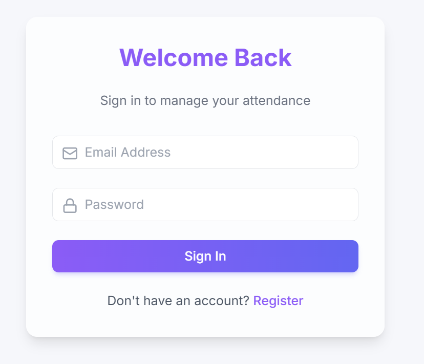
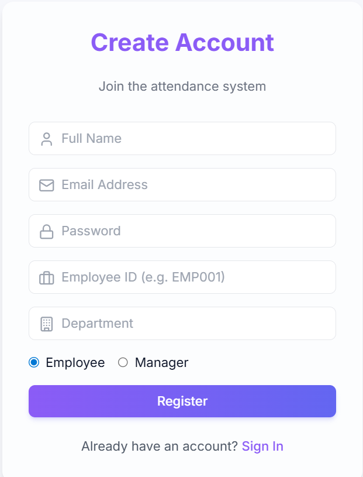
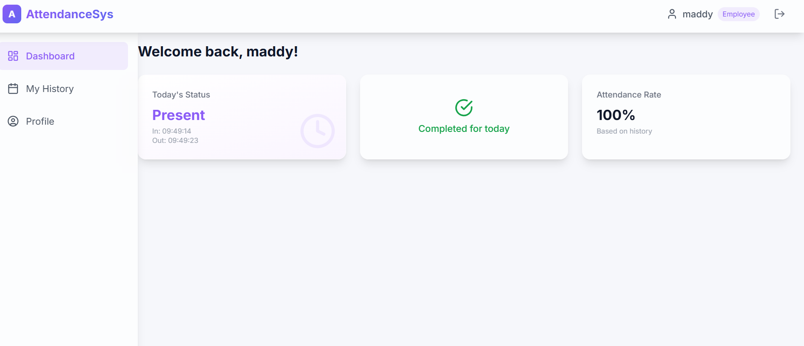
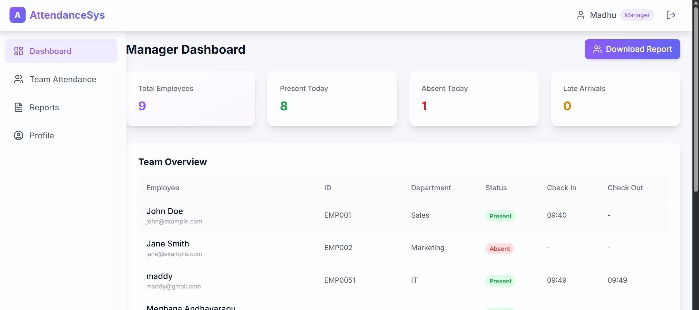

# Employee Attendance Management System
A full-stack MERN application for managing employee attendance with role-based authentication, analytics, calendar views, and CSV reporting. Designed for organizations to efficiently track attendance for employees and managers.

---

## 🚀 Tech Stack

**Frontend**
- React (Vite)
- Zustand
- TailwindCSS + Custom Styles
- Axios
- Recharts

**Backend**
- Node.js
- Express.js
- MongoDB Atlas
- Mongoose
- JWT Authentication
- bcryptjs

---

## ⚙️ Backend Setup

### 1. Navigate to backend folder

### 2. Install dependencies
PORT=5000

MONGO_URI=your_mongodb_atlas_uri

JWT_SECRET=your_64_character_secret
TOKEN_EXPIRES_IN=7d

### 4. Run backend server

Backend runs on:
http://localhost:5000

---

## 🎨 Frontend Setup

### 1. Navigate to frontend folder
cd frontend

### 2. Install dependencies
npm install

### 3. Run frontend
Frontend runs on:
https://employeeattenda-git-075db8-pendyala-madhu-sudhana-raos-projects.vercel.app?_vercel_share=zsyCP3VeFnrjf7NmNygHvj3lNvL0y51c

---

## 🔑 Environment Variables Summary

| Variable | Description |
|---------|-------------|
| PORT | Backend server port |
| MONGO_URI | MongoDB Atlas connection string |
| JWT_SECRET | Secret key for JWT token generation |
| TOKEN_EXPIRES_IN | Token expiration time |
| MANAGER_SECRET | Secret key required to register a manager |

---

## 🌱 Seed Database (Optional)

Run this to generate sample users + attendance:
cd backend
npm run seed

This will:
- Clear all users
- Create sample manager & employee accounts
- Insert sample attendance logs

---

## 📊 Features

### Employee
- Mark Attendance (Check-in & Check-out)
- View daily attendance history
- Monthly attendance summary
- Profile Page
- Calendar view with status colors

### Manager
- View attendance of all employees
- Weekly trend charts
- Department-wise charts
- Calendar view for entire team
- Attendance report export (CSV)
- Employee search functionality

### Security
- JWT authentication
- Protected API routes
- Role-based access control
- Manager registration with secret key

---

## 🖼️ Screenshots

### Login  

### Register 

### Employee Dashboard  

### Manager Dashboard  

---

## 🛠️ How to Run Full App

### Start backend
cd backend
npm run dev

### Start frontend
cd frontend
npm run dev
http://localhost:5173

---

## 🎯 Future Enhancements
- Face Recognition Attendance
- Export PDF reports
- Push notifications
- Geo-location based attendance
- Mobile app version

---

## 👨‍🎓 Author
**Madhu Sudhana Rao Pendyala**  
B.Tech CSE (Data Science), ANITS, Vizag  
Developed during training at **Tap Academy**

---

## ⭐ Support
If you like this project, please ⭐ the repository.
